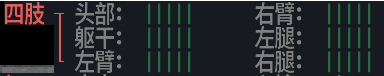
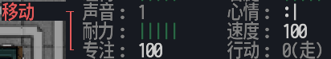

# 前言  

&emsp;《大灾变:黑暗之日》(Cataclysm:Dark Days Ahead)是一款发布了多年的上帝视角的字符沙盒免费开源游戏。游戏以朴素复古的DOS向玩家提供了丰富的游戏内容，让玩家在字符构成的世界中自由穿梭，与末日之后出现的丧尸和各种怪物战斗，在空旷的世界里收集资源建造家园想方设法的生存下去。 <!-- more -->   
&emsp;游戏虽然发布了多年但仍然在更新，这也让其收获了一众忠实玩家。随着版本的更新，游戏也支持了贴图包让游戏看起来更加容易接受。复古的界面，复杂细致的操作作为游戏的特点，在多年后今天已经可以说是缺点也不为过，这也使游戏难以跳脱小众的命运。如今时代的节奏不断加快，人们不再愿意为一款游戏停留过久。或许说对于一个刚接触这款的人来说，想要上手这款“古老的”游戏定是十分的不易。 
&emsp;如果经过前面对游戏的简单介绍，你能确定这是符合你的口味的游戏的话，那不妨接着往下看。本教程将以图文的视角带你以较为容易方式上手这款游戏，当然中间会穿插一些的别人对游戏某一方面详细的教程方便你日后有疑惑时查阅。   

# 游戏下载与中文设置及其他信息    
###  游戏的下载   
&emsp;下载地址:<https://cddabase.site/downloadpage/cn/index.html>    
&emsp;CDDA幸存者维护组提供了两个稳定的版本给大家下载。WIN,OSX,安卓都有对应。游戏压缩包下载到本地后，新建一个文件并解压到里面即可。随后点击【cataclysm-tiles.exe】即可开始游戏。Ps:无需安装。   
   
本教程的演示版本为两个版本中的:CDDA 0.D 9320   

### 设置中文   
   
&emsp;游戏运行起来应该就是这个中文的界面，如果不是的话可以进行以下操作:   
&emsp;使用【方向键↑↓】切换主菜单选项至\[Settings\]按下【方向键↑】进入子菜单选择\[Options\]并回车，然后使用【Tap】与【Shift+Tap】在\[Option\]菜单里切换到\[Interface\]子菜单并使用【方向键↑↓】选择子菜单\[Language\]此时使用【方向键←→】切换语言至“中文(天朝)”，最后按下ESC键选择Yes选择保存设置游戏就是中文的了。   
   

###  游戏其它信息 
&emsp;游戏主页:<https://cataclysmdda.org/>  
&emsp;游戏的维基百科:<https://cddawiki.chezzo.com/cdda_wiki>  
&emsp;游戏的GitHub主页:<https://github.com/CleverRaven/Cataclysm-DDA/>   
&emsp;游戏的贴吧:<https://tieba.baidu.com/f?kw=cataclysmdda>   

# 游戏的游玩   

### 正式开始之前    

* 贴图版的选择
&emsp;当前版本已经支持了贴图版。所以你可不用选择字符版进行游玩，游戏本身也自带了许多的贴图包。其中ChestHole32是>一个比较好的贴图包。在设置中文那有将如何切换主菜单的选项，及其他切换菜单的操作，不再赘述。

【设置】-【选项】-【图形】-【使用贴图包】 是
  

【设置】-【选项】-【图形】-【选择贴图包】 ChestHole32
  
   
&emsp;回车确认后,可在主菜单【新游戏】->【直接游戏】快速进入游戏查看贴图效果。   
&emsp;游戏中按光标键↑↓←→移动，Z键缩放贴图，!(英文)关闭安全模式，退出按ESC打开菜单光标↑↓键选择【S保>存退出】退出。    
* 字符版的选择
&emsp;游戏一开就是以字符版发行的，字符是游戏的特色之一。使用字符版调用的不是你的显卡，而是你的大脑。“一千个人的心里,有一千个哈姆雷特”，这个阅读文字能带来的效果。不要被贴图包限制住你想象力。但是直接使用字符版进行游戏会发现游戏里大量的字符拼接起来的游戏画面不是那么好看。这时候我们可以为游戏安装一种叫“九点字体”的字体来使游戏变得美丽。   
&emsp;字体下载链接:<https://tieba.baidu.com/p/4932216848?red_tag=1763590283>   
&emsp;打开作者提供的百度云网盘链接下载链接下载其中【CDDA适配字体>历史版本备份】里的字体包(适配字体20190412.0.rar)随后>下载【CDDA适配字体>2字体颜色配置】里的(低对比度配色20190906(草的绿色再降低一点).zip)。   
&emsp;打开游戏的安装目录，解压下载的压缩包后将里面的文件复制到对应的文件夹中覆盖即可。config文件夹一开始是没有的，需要运行一次游戏打开后关掉就会出现了 。  
   
&emsp;记得去到【设置】-【选项】-【图形】里照着上方的图片改改。不然字体可能无法呈现最佳的效果。  
 
&emsp;上图:站在十字路口，左上方停着一辆SUV，各种颜色的%表示不同怪物的尸体，逗号是雪。    
###  正式开始游戏 
#### 设置和创建世界 
&emsp;第一次打开游戏时就可以发现游戏的窗口很小，可以在【设置】->【选项】->【图形】中选择修改【终端宽度】和【终端高度】，游戏界面上部有提示会提醒你该值对应的像素，根据你的电脑屏幕或者手机屏幕来调整吧。重启后即可生效。或者更改【图形】里面的【全屏模式】为全屏模式就能全屏玩耍了。手机端的玩家可能将需要将【图形】里的【软件渲染】关掉才能在玩耍过程中切出游戏而游戏不会重启。   
&emsp;想要进行游戏需要先创建一个世界然后再建立人物。选择主菜单的【世界】里的【创建世界】，游戏里面是有NPC的但默认是待在一个地方不动的，想要在探险的途中遇到NPC的话在【当前世界设置】里将【生成随机NPC】打开就行。刚接触游戏其它默认就行【Tap】直接完成世界的创建。   
&emsp;游戏中切换菜单的方式有【Tap】与【Shift+Tap】和【<】与【>】两种，切换菜单里面里面的选项使用【方向键】。用到的地方挺多的，记不清到时候都试一遍就行。   
#### 建立人物 
&emsp;你可以在游戏中建立一个符合你内心中能在末日生存的形象，也可以选择游戏提供的一些特殊开局来挑战自己。如果你已经创建了多个世界的话，建立人物时会让你选择其中一个世界来建立人物。   
&emsp;选择主菜单的【新角色】，然后【点数】里选择统一点数，每个选项都会有绿色的字体解释的，要么下面，要么上面，左边右边。这里我挑个别解释。菜单【场景】和【职业】默认第一个就行。幸存者开局。在【特性】优点中回车选择【夜视】和【打包专家】，缺点中根据解释选择一些无伤对末日上次来说无伤大雅的就行，比如【说不出慌】【洁癖】【水果不耐症】等等，推荐选择【重度沉睡】和【耳背】。   
&emsp;幸存者开局是一个比较普通的开局，有些难度，也不会太难。不太强的开局前期可以体会到在末日生存时的艰难，在中后期发育起来后即可获得成就感。对于新人来说是个可以快速了解上手游戏的开局。   
&emsp;【打包专家】和【夜视】两个特性搭配可以让你在夜晚提前发现敌人并绕开，然后多捡些垃圾回家。世界里面的【当前世界设置】里的【怪物生成比例系数】=1，这是默认的设置，但在城市里面的话这个1会生成很多很多的丧尸真的。可能你杀了几十只丧尸才是一条街的量。所以千万不能跟丧尸换血，前期能不打就不打丧尸，我们晚上搜刮资源白天可以读一读捡到的书或者练技能。对了不要点【文盲】末世还是要学习滴。【重度沉睡】和【耳背】感觉带来的负面效果不是很明显。睡觉的时候找个安全的地方就行，【耳背】游戏没声音，又是上帝视角可以说是送点数。   
&emsp;来到【属性】和【技能】，【技能】里面消耗一个点数点一个【机械学】就行，其它剩余的点数都分配到属性里面就行。建议智力多加一点。智力高学习技能就快。要发挥人类的聪明的大脑啊。  
    
&emsp;在【描述】里起个名字确认一下信息按下【Tap键】就真正进入游戏世界了。     

####  开局与按键操作与游戏界面 

&emsp;首先把中文输入法关闭。本游戏是几乎用不到鼠标，通过键盘操作游戏的纯键盘游戏，并且按键区分大小写,之后提到的按键类似【E】与【e】大小写不一样就是不同的按键。如果你按下中文的符号的话，游戏是不会有反应的。【！!，,】很多键有中英文之分，所以先把输入法关了。如果你没更改【设置】【选项】【图形】里的【终端高度】和【终端宽度】的话，游戏窗口是没法显示上图那么多内容的。   
&emsp;那么现在我们应该考虑如何在末日生存下去了。先对上图的右侧的一些信息有些简略了解就可以开始玩了。   
   
&emsp;这个身体各部位的血条，头和躯干血条没了人物就死亡了。其它部位血条没了就算残废了。  
   
&emsp;主要是耐力需要注意，耐力没了就跑不动了，要多注意这个别冲到丧&emsp;尸堆里面去了。声音是做事产生的声音。按下【C】喊一嗓子能有11。   
   
&emsp;罗盘会显示你周围能你能看见并且不在你游戏屏幕的生物，“实际视野”你能看清方圆50几米的地图，“屏幕视野”可以用【z】【Z】调整。小地图中使用红色的点标记的生物可能会主动攻击你。   
&emsp;避难所一般都是在郊外的，想要进入城市搜刮资源的话，按下【m】查看大地图   
   
&emsp;从地图上看城镇是在避难所的左边，“F”表示森林，“<>∨∧”都是民宅的表示。你可以在大地图中使用【方向键↑↓←→】查看大地图上的每个字符，游戏界面的右上角会有当前选中字符的解释。大地图右边的有操作提示哦。按下对应的按键就行。【ESC】退出大地图。  
   
&emsp;知道城镇的位置后我们搜刮一下避难所就可以出发了。电脑端使用【方向键↑↓←→】控制人物移动，移动端在手机屏幕左半部分向各个方向滑动，按下【手机返回键】可调出手机键盘，屏幕底部的虚拟键盘也是通过【手机返回键】打开或者关闭。按下【z】或者【Z】可以切换视野大小。我们可以在避难所做出两件有用的东西后离开。   
&emsp;“简易背包”：【方向键↑↓←→】走到窗户旁边按下【s】使用【方向键↑↓←→】指明砸碎方向向窗户打去，窗户碎掉之后。按【e】查看地上的掉落物（很多按键都需要【方向键】指明操作方向哦），捡起“长线”（【方向键↑↓】切换物品选择，【方向键←→】选择取消选择物品，【,】英文逗号全选物品，回车捡起选中物品），随后走到明亮出制作物品“简易背包”按下【&】打开制作界面，在【装备】【全部】中找到“简易背包”回车制作。制作完后按下【W】穿戴装备,刚造好的多西要么在身上手上，要么在附件，找到“简易背包”回车确认穿上吧。  
&emsp;按下【i】打开物品栏就能看到身上有些什么了。   
   
&emsp;【物理学圣剑:撬棍】：捡起刚刚打碎窗户一同掉落的“重木棍”按下【w】找到它并手持它并把避难所里面的锁柜砸烂：【s】破坏东西，再捡起锁柜掉落的“钢管”和“钢块”走到明亮处按下【&】找到【武器】【全部】里面的“简易撬棍”制作。   
       
&emsp;做好撬棍后按【D】丢弃东西把“重木棍”丢了。【w】手持“简易撬棍”去看看地下室有没有东西。注意中英文：【>】下楼梯，【<】上楼梯。下去后小心可能有丧尸。走到东西上面按下【g】就可以捡了。我捡了“绷带”“打火机”。如果你的地下室有丧尸的话，先向下看，下面有讲战斗。你不操作游戏游戏就是暂停的哦。   

#### 按键整理

&emsp;有人整理了游戏的按键哦:<https://www.taptap.com/topic/245108> PS:PC与PE的按键是通用的。  
&emsp;你也可以打开【ESC主菜单】找到【行动菜单】里面列出了有很多操作都是与快捷键对应的。花几分钟看看吧。  
&emsp;他人整理的图片版:        
   

#### 潜入城镇   
&emsp;从这里开始的话遇到危险的可能性就更大了。可在【ESC主菜单】里找到【快速保存】避免自己白费时间。走出避难所记得随手关门。【c】关门，【o】开门。稳妥的办法是我们先在避难所待到天黑再进城。按下【|】等到黄昏消磨生命吧。在这里保存一下。白天摸过去也可以丧尸太多的话就回来老老实实等到天黑。回不来就读档哈哈。   
&emsp;去城镇的路上也要小心野生动物和怪物。在罗盘中看到&米戈的话就躲远点吧。打不过也跑不过。驼鹿也会攻击人，也许是发情期吧，很暴躁。总之存个档白天去看看。键盘上右边的小数字键盘也可以用来移动哦，除了【0】和【5】其它键都能向一个方向移动。   
&emsp;去城镇的路上遇到会主动攻击你的怪物的话，系统会打开安全模式锁定你的键盘。按下【!】关闭安全模式或【'】单引号忽略敌人。不过不要关闭安全模式，使用忽略就行了。这是防止你关闭安全模式后乱走还没注意到怪接近你。  
&emsp;游戏中有两种战斗方式，远程和近战。一样东西只要能拿在手上就能当武器近战。当然有些东西拿来打架还不如用拳头。现在当你准备使用近战武器战斗时，只需要向你想攻击的方向移动就行了。是的，就是这么朴实无华的战斗。前提怪已经站你周围1格。以玩家为中心画一个九宫格的话，能攻击到除了玩家之外的8格。战斗结束后记得把丧尸的尸体都打碎【s】，不然会复活。   

#### **近战打法**   
* 一、跑打:当怪接近你时，按下【"】:英文的双引号,切换行动模式到跑。在忽略耐力的情况下，很多怪都跑不过你的。所以你跑两步与怪拉开一格距离。然后当怪接近时打一下再拉开距离。如此反复。【.】【5】这两个键是不行动。时刻注意你的耐力。没体力你就凉了。   
    
* 二、地形杀:**有些怪**有些怪就是铁憨憨，它会直直的的向你扑来，哪怕你前面有个坑。这时候就是利用地形的时候。一些可以借助的常见地形有“灌木丛”，字符：‘#’,“窗户”等等。你可以用【x】查看地形的行动值消耗。高于100行动值就能当地形杀。当然别站撸啊，打一下溜，再重新引回来。Ps:想挖个坑的话需要使用带有【挖掘】特性的工具，然后按下【a】使用物品选择挖掘工具进行挖坑。   
      
&emsp;这里讲一下行动值。做事就会消耗行动值。使用武器攻击也会消耗行动值。沉重的武器行动值普遍较高。使用行动值低的武器可以在短时间内打击多次敌人，如果敌人处在高行动值消耗的地形上时，可以使用行动值低的武器攻击敌人因为它被地形消耗了行动值无法立即还击。   
&emsp;按下【V】可以查看你视野内的生物和物品，【Tap】切换，在生物栏那里怪物发现你的话前面会有个黄色的感叹号，这样就能控制拉怪的数量了。    
&emsp;攻击距离超过一格的武器应该都算远程了。当然想攻击远处的敌人的话按下【t】投掷手中的物品也行。技能不高难打中就是了。言归正传，远程武器按下【f】攻击。然后你需要瞄准目标。
   
&emsp;【p】是最准的射击模式。当然也要瞄最久。根据敌人的位置和武器的精准度决定射击模式。下方的“*”越多打中的几率越高。   
&emsp;如果你摸到到了一户民宅边上的话，就可以用“简易撬棍”敲开门或者窗户了。建议撬门，撬窗户失败可能会弄破窗户产生较大声音。在手上有撬棍的情况下按下【e】选择方向直接撬。或者不在手上按下【a】找到身上的具有【撬棍】特性的工具也能用。  
  
&emsp;进去后记得把窗帘拉上按下【c】再关一次有窗帘就会关窗帘，悄咪咪的搜刮就行了。丧尸从外面看到你会冲进来的。当然民宅里面可能有也丧尸。民宅的食物主要在冰箱里面。【e】查看。稳妥一些的话，在第一个屋子里等到天黑再出去搜刮把。怕的话按下【G】拖家具堵门哈哈。不过拖家具有声音的哦。如果你现在对游戏按键还是不太清楚的话，可以回到上面看一下按键的总结哦。少知道一种操作可能就不是一个玩法了。   

### 部分搜刮点简要介绍与载具系统与枪械  
&emsp;消防局:里面可以能找到消防斧，挺给力的近战武器。消防员丧尸也可能掉。消防员丧尸不是很强。         
&emsp;杂货店:里面有购物车可以放50升的东西，按【G】拖回家。购物车也是载具。关于载具下面说。   
&emsp;民宅:啥都可能有。别到后面懒得去了。有些大户人家地下室是枪室。   
&emsp;枪械商店:撬不开的，要用钢锯锯开铁窗，【a】是使用物品。或者找个“冲击钻”把墙拆了。   
&emsp;图书馆/书店:重点，科技是第一生产力:看书是提升技能的最快方式。按【@】查看自己的信息。里面【Tap】。   
&emsp;车库:有修车工具。或者直接能开车。   
&emsp;医院:有全自动医疗仪，可以给你装CBM。有几率失败。百分百成功的话要在创建世界那模组列表【平衡】里添加【完全可靠的医疗仪】模组。   
&emsp;实验室:有CBM，有高级装备，有枪械库，有图书馆。比较危险，没点实力别去。可能很冷，得准备一套防寒装。    
&emsp;其它自己探索吧。   
&emsp;关于枪:枪，子弹，弹夹是一个整体。有些枪光有子弹不行还需要弹夹的才能射击。这三样进背包会有颜色。绿色说明你凑齐了。淡粉是有枪，其余之一。      

# 载具
&emsp; 这是又是游戏的一个有趣的系统了，比较复杂。如果你有个房车梦的话，应该了解一下。没有也要了解一下，探索过的地图不刷新物资的，去别的城市要开车。b站有比较好的实况教程我就直接贴链接了。   
&emsp; B站南风橙:  
&emsp; &emsp; 【初级车辆教学】<https://www.bilibili.com/video/av6795551>   
&emsp; &emsp; 【中级级车辆教学】<https://www.bilibili.com/video/av11599364>      
&emsp; 这是他实况教学的一部分。有兴趣都看看。   
# 游戏其它部分内容
* 【&】制作与【*】建造    

* 末日生存游戏的可玩点这两个是跑不了的。有事没事看看有什么东西是你可以造或者即将可以造且对你有帮助的东西。

* 生化插件:cbm    
 &emsp;&emsp;装上就能有特殊的能力。【p】查看。
*  其它教程   
&emsp;&emsp;贴吧和QQ群。【Cataclysmdda吧】。游戏比较小众，网上直接搜可能没得，去群里贴吧问，会有热心老哥帮你的。

# 入坑教程结束
&emsp;相信在看完教程后的你会有一定的能力在末世摸爬滚打。在这个世界里面不断发展自己并对游戏有了更多认知之后你的异世界之旅才刚刚开始。   
&emsp;《Cataclysm:Dark Days Ahead》真的是一款非常优秀的游戏。应为只是入门教程所以，游戏还有很多的东西本教程没有讲到。只做到入门是为了大家可以自己去探索游戏的更多内容，更多的感受该游戏。游戏是很适合多次重玩的，所以不要盯着一个档一直玩。重开一个档也有别样风味。